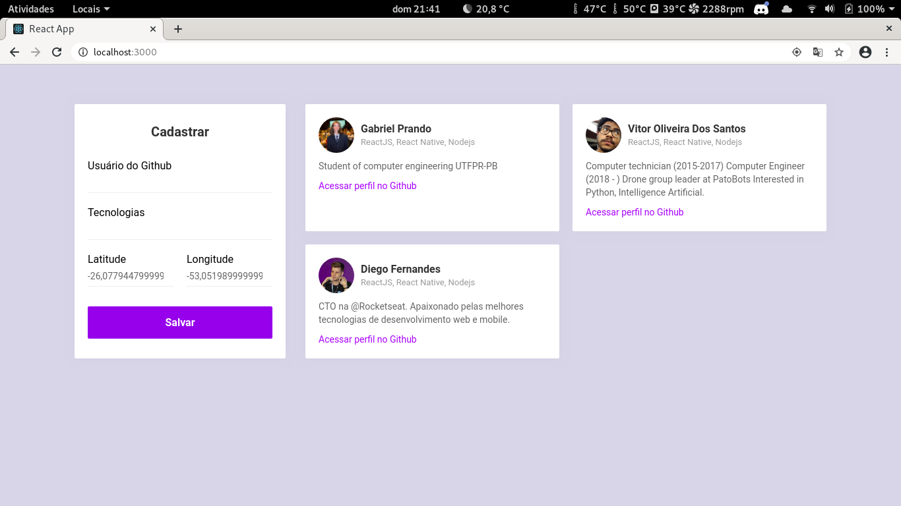
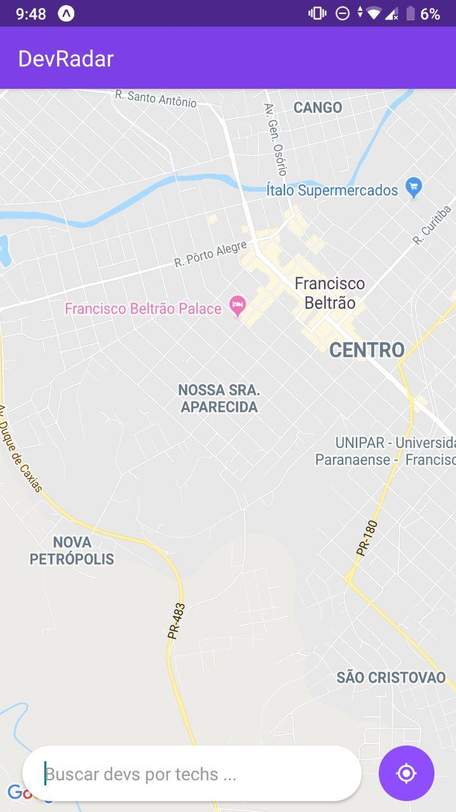

<h1 id="titulo" align="center"  > Dev Radar  
 

The monorepo of a mobile and web app, to locate devs in your vicinity, built in a week Omnistackt

  

  
  

This app features all the latest tools and practices in mobile development!

- ⚛️ **React Js** — A JavaScript library for building user interfaces
- ⚛️ **React Native** — A lib that provides a way to create native apps for Android and iOS
- 💹 **Node Js** — A web framework for Node Js
- 📄 **MongoDB** — A cross-platform and open-source document-oriented database
- ♻️ **Socket IO** — A library for realtime web applications 

## Getting started

1. Clone this repo using `https://github.com/gprando/DevRadar.git`
2. Move yourself to the appropriate directory: `cd DevRadar` 
3. Run `yarn` to install dependencies 

### Getting started with the backend server

1. Move yourself to the backend folder: `cd backend`
2. configure your connection to mongodb within the index.js file 
3. Run `yarn dev` to start the server

### Getting started with the frontend app

1. Move yourself to the frontend folder: `cd frontend`
2. Run `yarn start` to start the web application

### Getting started with the mobile app

1. Move yourself to the mobile folder: `cd mobile`
2. Run `react-native run-ios` (or `run-android` if your prefer) to start the mobile app

Note: If you choose to start the mobile app in the android emulator, you will have to start the emulator before using
the `run-android` command.

## License

This project is licensed under the MIT License - see the [LICENSE](https://opensource.org/licenses/MIT) page for details.
