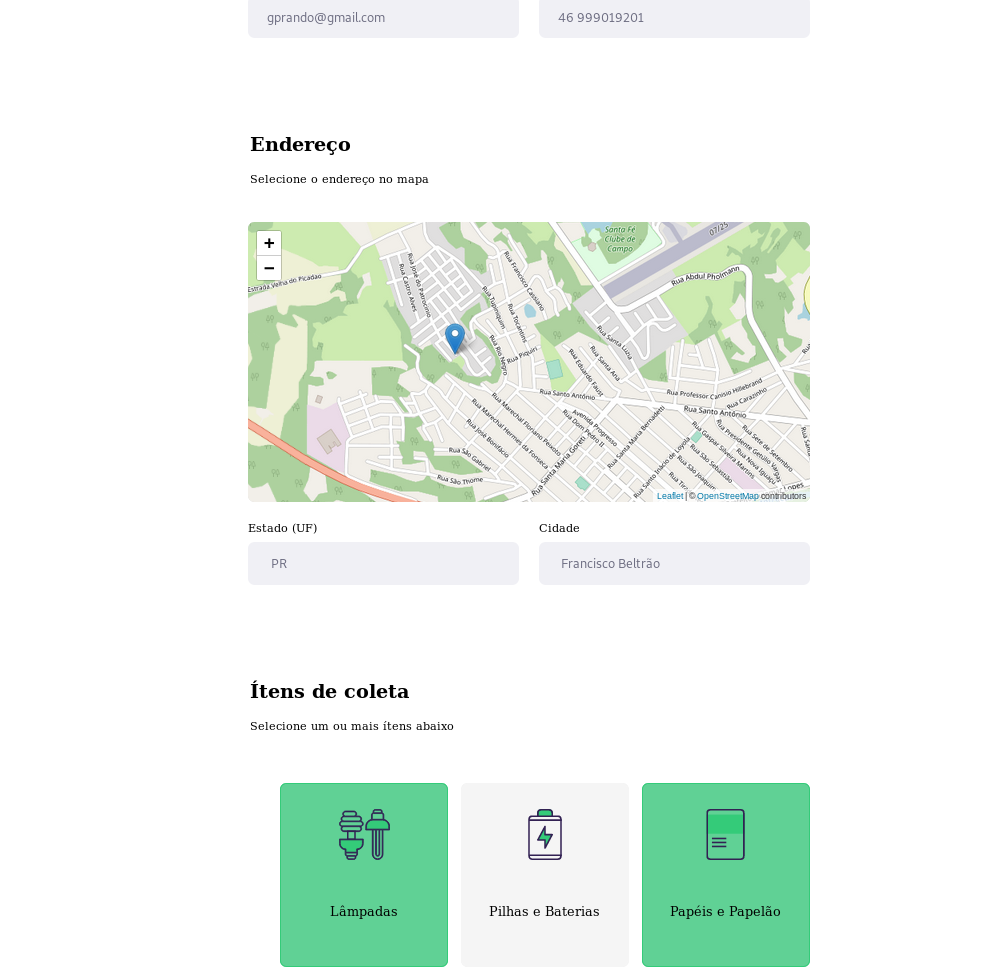
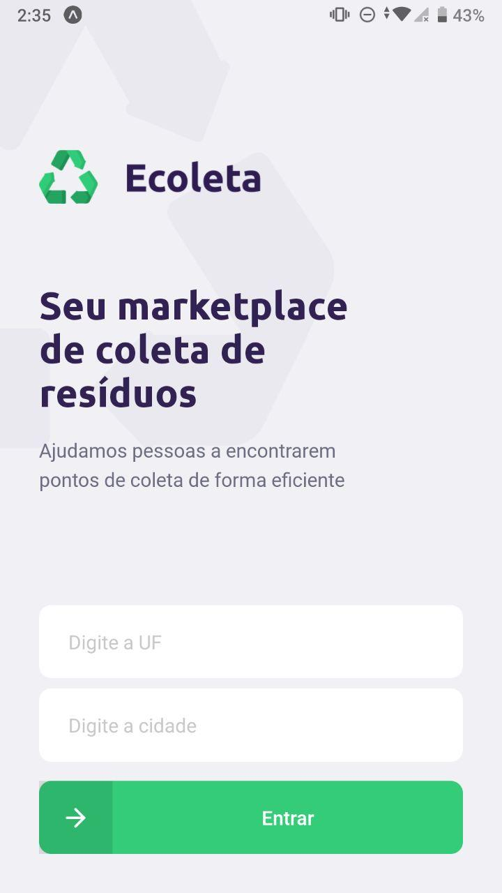

<h1 align="center">
  
<br>
Next Level Week 01 - Ecoleta
</h1>

<p align="center"> 🚀 Ecoleta: Aplicação desenvolvida na primeira Next Level Week feita pela Rocketseat.

<p align="center">
  <a aria-label="Prando" href="https://github.com/gprando/">
    </img>
  </a>
    </img>
    </img>
</p>
<p align="center">
  <a href="https://opensource.org/licenses/MIT">
    
  </a>
</p>

## Features
Utilização de API do IBGE e API de Maps Leaflet utilizando as tecnologias:

- 💹 **TypeScript** -  Tipagem estática;
- ⚛️ **React Js** — Desenvolver interface Web de alta performance;
- ⚛️ **React Native** — Desenvolver app mobile de forma nativa para Android e IOS;
- 💹 **Node Js** — Web framework que permite utilizar javascript tanto no frontend quanto no backend;

## Projeto

Ecoleta é um projeto onde facilita a informação de pontos de coleta de rísiduos, podendo o usuário tanto como cadastrar um novo ponto de coleta, informando localidade e itens coletados, como pesquisar por locais de coleta.

## Getting started

<h1 align="center"></img></h1>

## Instalação - Projeto
Clone o projeto em seu computador.

```bash
git clone https://github.com/gprando/NLW_01
```

## Backend
Para instalar as dependências e executar o **Servidor** (modo desenvolvimento) execute:
```bash
cd backend
yarn 
yarn dev
```
### Insomnia 
Para testar a API do Ecoleta, baixe e instale o [Insomnia](https://insomnia.rest/download/) e em seguida clique no botão a baixo para importar o workspace.

[](https://insomnia.rest/run/?label=Ecoleta&uri=https%3A%2F%2Fraw.githubusercontent.com%2Fgprando%2FNLW_1%2Fmaster%2Fbackend%2FInsomnia.json%3Ftoken%3DAL5YELH3YXHGUAUAVYKK33264EYSO)
  

### Frontend
Para iniciar o **Frontend** do React utilize os comandos:
```bash
cd frontend
yarn 
yarn start
```
Assim que o processo terminar, automaticamente será aberta no seu navegador a página `localhost:3000` contendo o Projeto desenvolvido no dia 3 de 5.  

### Mobile

* Precisará ter instalado em seu celular o app expo.  

Para iniciar o **Mobile** do React-Native utilize os comandos:

```bash
cd mobile
yarn 
yarn start
```
Abra a app Expo e leia o qr code do app.

<h1 align="center"></img></h1>


## 🤔 Como contribuir

Se quiser contribuir para esse repositório aqui, seja corrigindo algum problema, adicionando comentários ou melhorando a documentação, você pode seguir esse tutorial abaixo:

- Faça [um fork](https://help.github.com/pt/github/getting-started-with-github/fork-a-repo) desse repositório;
- Entre no seu perfil no GitHub e faça um clone do repositório que você fez um *fork*;
- Crie uma *branch* com a sua alteração: `git checkout -b minha-alteracao`;
- Faça as alterações necessárias no código ou na documentação;
- Faça *commit* das suas alterações: `git commit -m 'feat: Minha nova feature'`;
- Faça *push* para a sua *branch*: `git push origin minha-alteracao`;
- Agora é só abrir a sua *pull request* no repositório que você fez o *fork*;

Depois que o *merge* da sua *pull request* for feito, você pode deletar a sua *branch*.

## :memo: Licença

Esse projeto é licensiado pela MIT License - Veja a página da [licença](https://opensource.org/licenses/MIT) para detalhes
