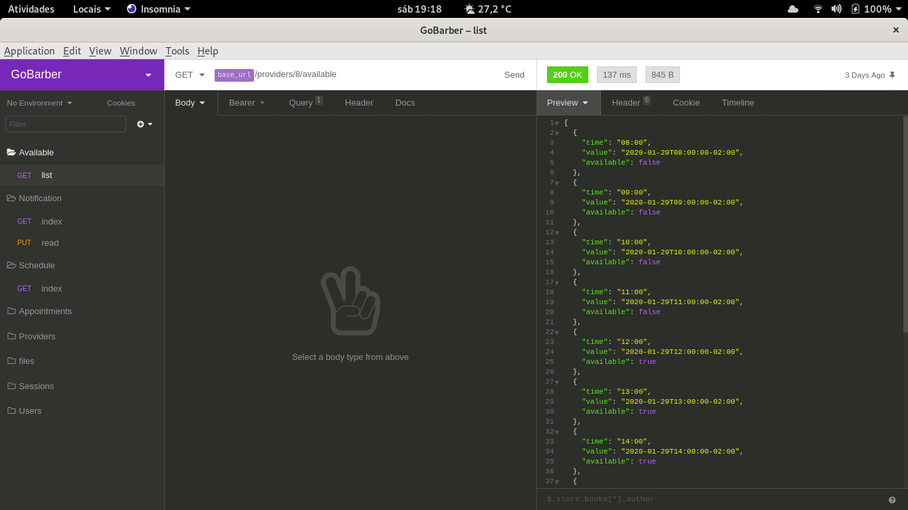

<h1 align="center"> Go-Barber
<br>
  
<br>
</h1>


<p align="center">Scheduling API</p>
<p align="center">
  <a href="https://opensource.org/licenses/MIT">
    
  </a>
</p>

## Technologies

- [Node](https://nodejs.org/en/)
- [Express](https://expressjs.com/pt-br/)
- [Express-Session](https://www.npmjs.com/package/express-session/)
- [Sequelize](http://docs.sequelizejs.com/)
- [Postgres](https://www.postgresql.org/)
- [Bcrypt](https://www.npmjs.com/package/bcryptjs/)
- [Multer](https://github.com/expressjs/multer/)
- [Moment.JS](https://momentjs.com/)
- [dotenv](https://www.npmjs.com/package/dotenv)
- [Eslint-Airbnb](https://eslint.org/)
- [Nodemon](https://nodemon.io/)

## Installation

Clone the project with

```sh
git clone https://github.com/gprando/GoBarber.git
```

Get in the path project, then install the dependencies with:

```sh
yarn
```

Then, you have to create your postgres database (Or another if you want) and fill your own fields in .env file.

Now, you have to create tables with the command:

```sh
npx sequelize db:migrate
```

After database config, you can start the server with:

```sh
yarn start
```

If you are in development environment, you can use the development server:

```sh
yarn dev
```


## To test in insomnia

[](https://insomnia.rest/run/?label=GoBarber&uri=https%3A%2F%2Fraw.githubusercontent.com%2Fgprando%2FGoStack%2Fmaster%2FInsomnia.json%3Ftoken%3DAL5YELADWR2D36FSLFIRYB26GX33G)


## License

This project is licensed under the MIT License - see the [LICENSE](https://opensource.org/licenses/MIT) page for details.